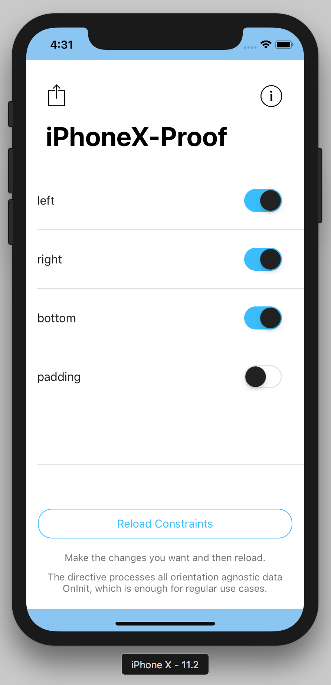
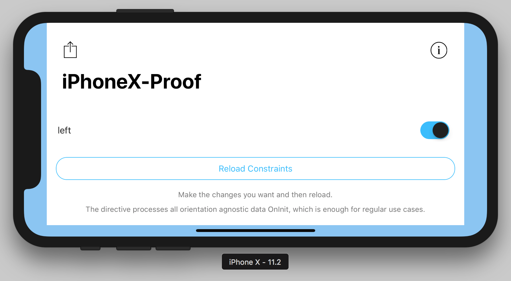

# nativescript-ngx-debounce-tap

[![NPM version][npm-image]][npm-url]
[![Downloads][downloads-image]][npm-url]
[![Twitter Follow][twitter-image]][twitter-url]

[npm-image]:http://img.shields.io/npm/v/nativescript-ngx-debounce-tap.svg
[npm-url]:https://npmjs.org/package/nativescript-ngx-debounce-tap
[downloads-image]:http://img.shields.io/npm/dm/nativescript-ngx-debounce-tap.svg
[twitter-image]:https://img.shields.io/twitter/follow/xmr_nkr.svg?style=social&label=Follow%20me
[twitter-url]:https://twitter.com/xmr_nkr

{N} + Angular directive to implement safe area margins or paddings especially on iPhone X.

## Installation

```
tns plugin add nativescript-ngx-iphonex-safe-area
```

## Usage 

### Import the module in your app module

```typescript
import { NgiPhoneXSafeAreaModule } from 'nativescript-ngx-iphonex-safe-area';

@NgModule({
    imports: [
        NgiPhoneXSafeAreaModule,
        // ...
    ],
    // ...
})
export class MyModule { }
```

### Import the CSS or SCSS file depending on your project

If your project uses good old css import the classes the directive will apply to your views like so...

```css
@import 'nativescript-ngx-iphonex-safe-area/css/iphonex.css';
```

In case your project uses scss instead, use this syntax to import the classes...

```scss
@import '~nativescript-ngx-iphonex-safe-area/scss/iphonex';
```

### Finally use it in your templates like so

```xml
 <GridLayout iPhoneX [mind]="['left', 'right', 'bottom']" [padding]="true"></GridLayout>
```

### The result will be something like this...




Notice those blueish painted areas? Well, those are the safe area!

If you want a quickstart, [check out the demo app](https://github.com/mrnkr/nativescript-ngx-iphonex-safe-area/tree/master/demo).

> I promise, this won't break your app in devices other than the iPhone X.
> - Me

## API
    
| Property | Type | Default | Description |
| --- | --- | --- | --- |
| mind | string[] | ['left', 'right', 'bottom'] | Think of the name as the typical 'Mind the gap' from London Underground. It tells the directive whether it should mind the safe area only at the bottom, only the left or any combination you might need. |
| padding | boolean | false | You can use this property to tell the directive to apply padding instead of margin to your views. |


## License

Apache License Version 2.0, January 2004